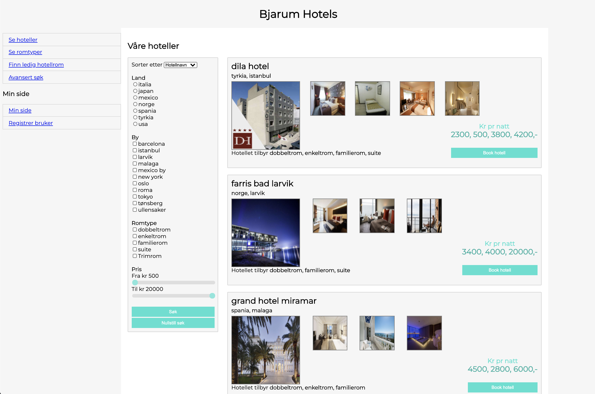

# Bjarum Hotels

2-ukers gruppeeksamen i emnet PRG1100 "Grunnleggende programmering 2" våren 2018.

### Nettsted

### MinSide
Testbruker: minside / minside

### Vedlikeholdsapplikasjon
Testbruker: admin / admin

## Teknologi

- PHP
- HTML
- CSS
- JS
- MySQL

## ER-modell av databasen

## Oppgavebeskrivelsen

> Hotellkjeden Bjarum Hotels er en fiktiv hotellkjede med hoteller over hele verden  
> Oppgaven går ut på å lage et nettsted (for hotellbestilling) og en vedlikeholdsapplikasjon for Bjarum Hotels.  

> Nettstedet skal være åpent for alle som ønsker å bestille hotell og skal ikke kreve innlogging. På nettstedet skal kundene kunne:
>
> - se oversikt over ulike hoteller (for angitt sted)
> - se oversikt over ulike romtyper (for angitt hotell)
> - finne ledige hotellrom (for angitt sted/hotell og angitt dato/tidsperiode, evt. angitt romtype)
> - registrere seg på minside
>    

> Minside er for registrerte kunder og skal kreve innlogging. På minside skal kunder kunne
>
> - bestille hotell
> - se egne hotellbestillinger
> - endre egne hotellbestillinger
> - slette egne hotellbestillinger
>    

> Vedlikeholdsapplikasjonen er for systemansvarlige på Bjarum Hotels og skal kreve innlogging. Vedlikeholdsapplikasjonen skal inneholde brukerfunksjoner for:
>
> - registrering av data i hver av de 4 tabellene (beskrevet nederst)
> - visning av alle data fra hver av de 4 tabellene
> - endring av data i hver av de 4 tabellene
> - sletting av data i hver av de 4 tabellene
> - se oversikt over alle registrerte kunder
> - se oversikt over alle registrerte hotellbestillinger

> **Testbrukere:**  
> Vedlikeholdsside: admin/admin  
> MinSide: minside/minside

## Ansvarsområder
@PPindsle: Nettsted   
@TinaRam: Vedlikeholdsapplikasjon, registrering/innlogging, database
